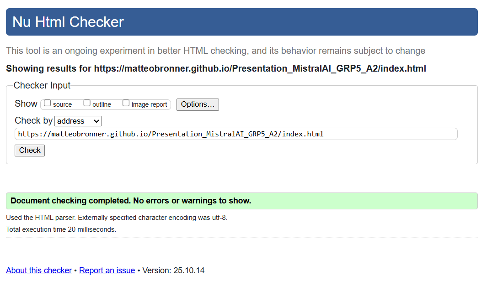
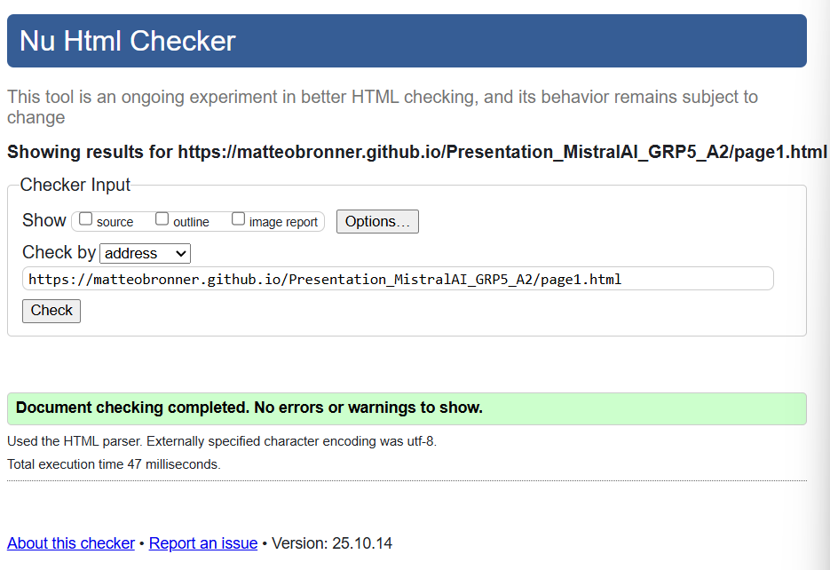
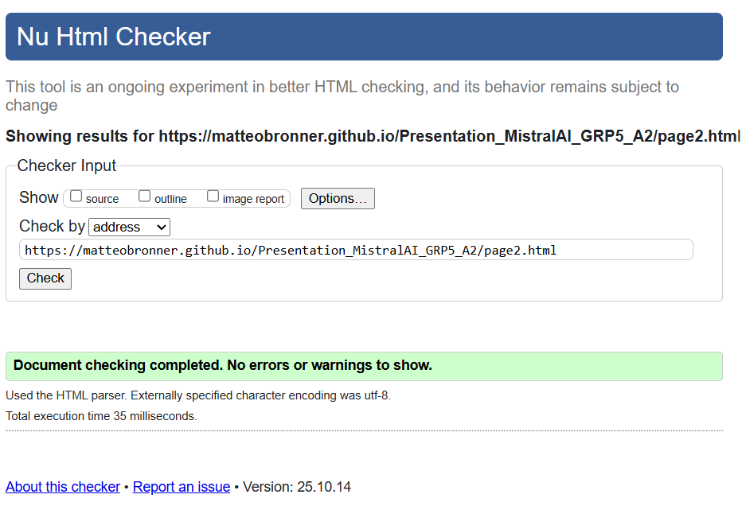
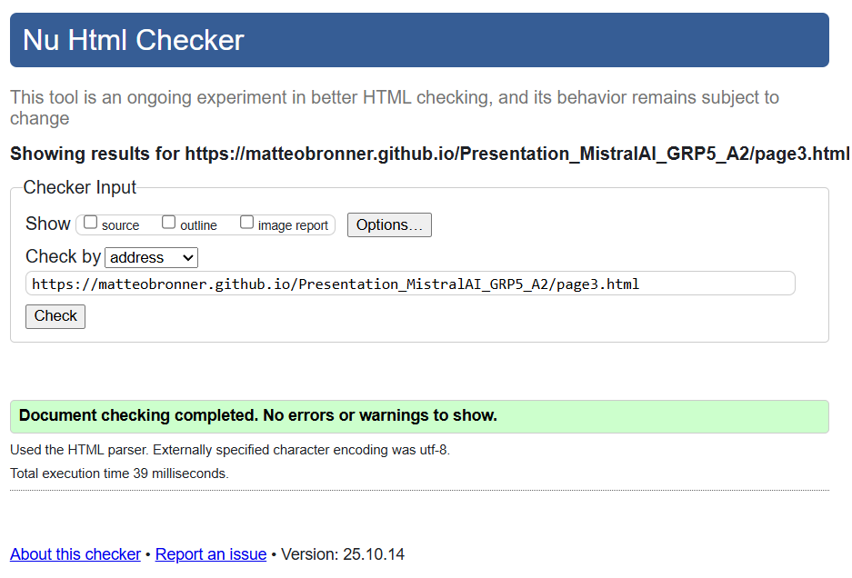
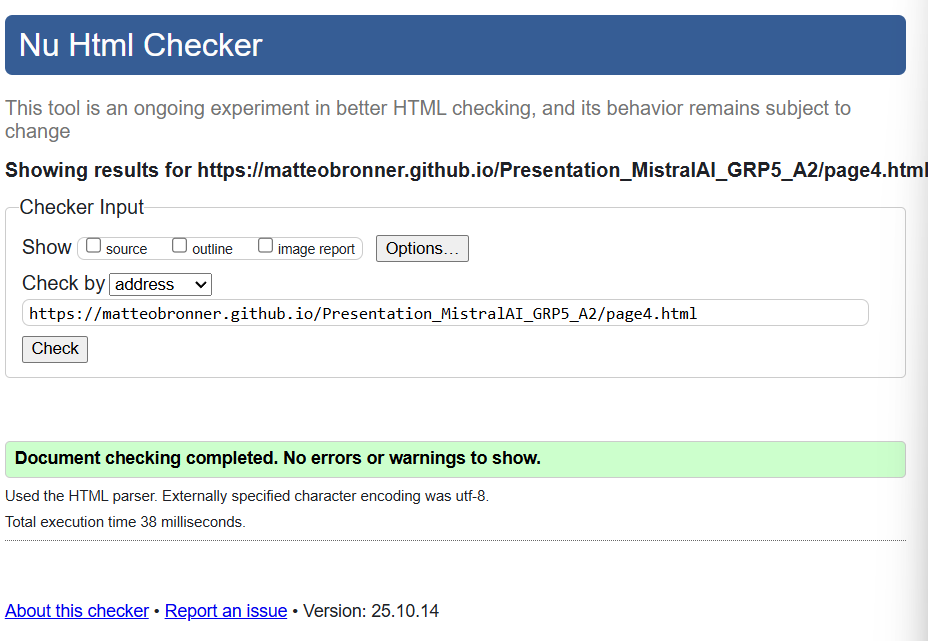
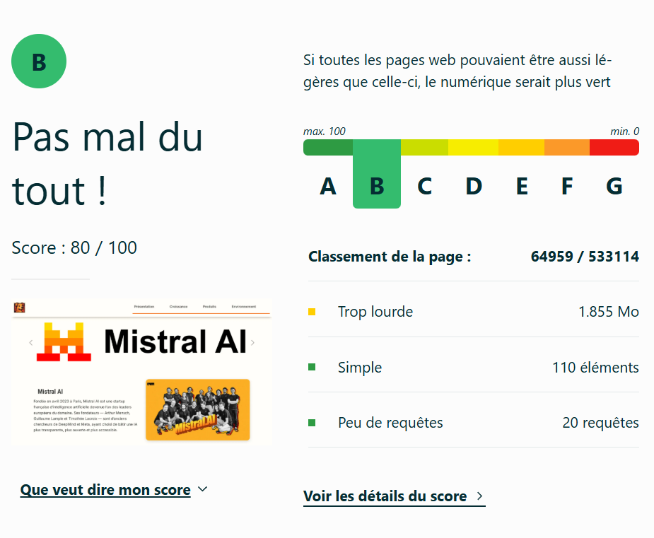
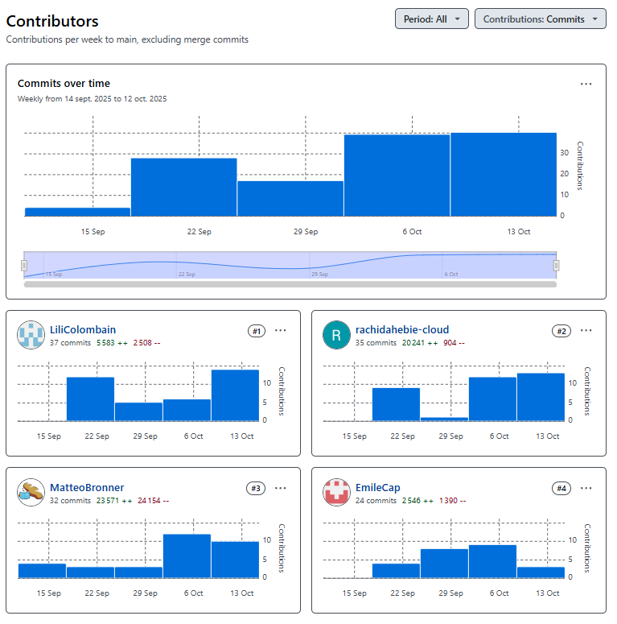

## Mistal AI

## Présentation de Mistral AI

[Presentation MistralAI](https://matteobronner.github.io/Presentation_MistralAI_GRP5_A2/)

## Membres du groupe :

Etudiant 1 (référent du groupe) :  [COLOMBAIN Lili](mailto:lili.colombain@edu.univ-fcomte.fr?subject=SAE_1_05_06)  
Etudiant 2 : [HEBIE Tie Rachida](mailto:tie_rachida.hebie@edu.univ-fcomte.fr?subject=SAE_1_05_06)   
Etudiant 3 : [BRONNER Matteo](mailto:matteo.bronner@edu.univ-fcomte.fr?subject=SAE_1_05_06)  
Etudiant 4 : [CAP Emile](mailto:emile.cap@edu.univ-fcomte.fr?subject=SAE_1_05_06)  

# Présentation du projet

Le site Mistral AI aura pour objectif de présenter l’entreprise de façon claire en combinant
les informations économiques et écologiques.
La page d’accueil offrira une vue d’ensemble, tandis que les pages spécialisées
détailleront les aspects financiers et environnementaux.

Le site sur Mistral AI a pour objectif de réaliser une analyse économique complète, mettant en lumière : 
  - Son modèle économique unique (avec des levées de fonds record, des partenariats stratégiques et un soutien public et la comparaison avec ses concurrents)
  - Ses différenciateurs clés (Technologie, éthique, impact social)
  - Son engagement environnemental (empreinte carbone réduite, initiatives durables)

Grâce a ce site nous pourrons comprendre l'impact global de Mistral en France et en Europe et évaluer son positionnement face aux géants de l'IA.

## Choix de conception  

Pour la conception du site, nous nous sommes grandement inspirés du site officiel de [Mistral AI](https://mistral.ai/fr) en raison de son ésthétique original et plaisante.
De plus, le site du gouvernement français ([info.gouv](https://www.info.gouv.fr)) a influencé notre approche, notamment par son utilisation efficace de zones de présentation pratiques (encadrés, rubriques, bannières), particulièrement visibles sur sa page d'accueil.
Pour la mise en page des informations et la représentation des données économiques dans le contenu des pages, nous nous sommes basés sur les designs de [Wagtail](https://wagtail.org) et [Ouworlindata](https://ourworldindata.org).
Enfin, nous avons créé une charte graphique pour notre site que vous pouvez retrouver [ici](doc/5_COLOMBAINLili_StyleTile.pdf) (en attente des réponses du questionnaire n°2).

## Répartition du travail

### Planification - Diagramme de GANTT

- Colombain Lili

### Recherches d'informations

- Hebie Tie Rachida 
- Colombain Lili
- Bronner Matteo
- Cap Emile

### Développement site (en cours)

- Colombain Lili
  - Page économie
  - "Template" du site 
- Bronner Matteo
  - Page de présentation
  - Page d'accueil
- Hebie Tie Rachida
  - Page environnement
- Cap Emile
  - Page produit et concurrence

## Développement Site Web et Validation des pages

### Page d'accueil

**Auteur : Bronner Matteo**  

Vérification W3C : [Détail ICI](https://validator.w3.org/nu/?useragent=Validator.nu%2FLV+https%3A%2F%2Fvalidator.w3.org%2Fservices&acceptlanguage=&doc=https%3A%2F%2Fmatteobronner.github.io%2FPresentation_MistralAI_GRP5_A2%2Findex.html)

**Auteur : Bronner Matteo**  

Vérification W3C : [Détail ICI](https://validator.w3.org/nu/?doc=https%3A%2F%2Fmatteobronner.github.io%2FPresentation_MistralAI_GRP5_A2%2Fpage1.html)

**Auteur : Colombain Lili** 

Vérification W3C : [Détail ICI](https://validator.w3.org/nu/?doc=https%3A%2F%2Fmatteobronner.github.io%2FPresentation_MistralAI_GRP5_A2%2Fpage2.html)

**Auteur : Cap Emile**

Vérification W3C : [Détail ICI](https://validator.w3.org/nu/?doc=https%3A%2F%2Fmatteobronner.github.io%2FPresentation_MistralAI_GRP5_A2%2Fpage3.html)

**Auteur : Hebie Tie Rachida**

Vérification W3C : [Détail ICI](https://validator.w3.org/nu/?doc=https%3A%2F%2Fmatteobronner.github.io%2FPresentation_MistralAI_GRP5_A2%2Fpage4.html)

**Validation de l'écoconception :**

## Contributeurs

